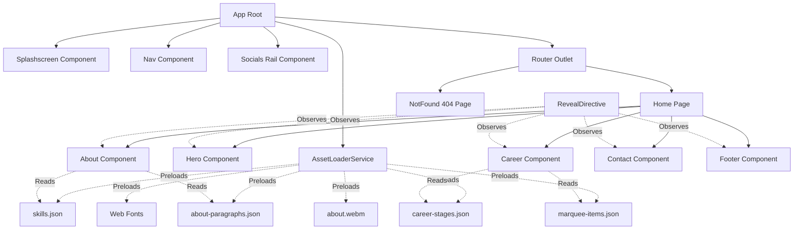

# Technical & Design Specification: Amith Patil Portfolio (v3)

## 1. Executive Summary

**Amith Patil Portfolio (v3)** is a modern, high-performance personal portfolio web application built with **Angular 21**, **Tailwind CSS v4**, and **Express SSR**. It showcases Amith Patil's background as a Senior Solutions Engineer at Google specializing in Enterprise AI & Security.

The application adheres to a futuristic, cybernetic/sci-fi minimalist aesthetic characterized by deep obsidian backgrounds, high-contrast neon-orange accents, polygonal chamfered silhouettes (`clip-path`), glassmorphic overlays, and hardware-accelerated micro-interactions.

---

## 2. Technology Stack & Tooling

| Layer | Technology | Purpose / Rationale |
| :--- | :--- | :--- |
| **Framework** | Angular 21 (Standalone Components) | Strict type safety, modular architecture, native reactive Signals |
| **Rendering Strategy** | Angular SSR + Client Hydration | Server-Side Rendering via Express, `withEventReplay()` for seamless hydration |
| **Styling** | Tailwind CSS v4 + Vanilla CSS Variables | Modern token system with `@theme`, rapid utility styling, custom hardware-accelerated animations |
| **Typography** | Google Sans, Roboto Mono, Smooch | Clean sans-serif hierarchy paired with industrial monospace elements |
| **Iconography** | FontAwesome 6 (CDN) + Custom SVGs | Scalable vector graphics with custom stroke animations and dynamic DOM sanitization |
| **Animation & Interactions** | CSS Keyframes + LERP rAF Engine + Lenis | High-performance outside-zone mouse tracking, multi-layer parallax, smooth inertial scroll, and scroll reveals |
| **Data Architecture** | Decoupled JSON Datastores | Content stored in `public/*.json` assets fetched asynchronously via `HttpClient` |
| **Build & Test Engine** | Angular CLI 21, Vitest 4, PostCSS | Modern build pipeline and unit testing harness |

---

## 3. Design System & Visual Philosophy

### 3.1. Color Palette

```
Neutral Base:      #0a0a0a (bg-neutral-950) | #171717 (bg-neutral-900)
Brand Accent:      #f97316 (orange-500)
Accent Glow:       rgba(249, 115, 22, 0.6)
Text High:         #ffffff (white)
Text Medium:       rgba(255, 255, 255, 0.70)
Text Low:          rgba(255, 255, 255, 0.40)
Borders & Grids:   rgba(255, 255, 255, 0.05) to rgba(255, 255, 255, 0.10)
```

### 3.2. Typography Hierarchy

- **Display Giant**: `clamp(6.8rem, 11.8vw, 20.5rem)` — Google Sans Bold.
- **Section Headers (Vertical)**: `6xl` to `8xl` with `-webkit-text-stroke: 1px rgba(255,255,255,0.15)` and `writing-mode: vertical-lr / vertical-rl`.
- **Monospace Labels & Numbers**: Roboto Mono (`text-[10px]` to `text-xs`) with uppercase tracking (`tracking-[0.2em]` to `tracking-[0.4em]`).
- **Body & Paragraphs**: Google Sans Light (`text-sm` to `text-lg`), `leading-relaxed` on dark canvas.

### 3.3. Geometric Language & Chamfers

- **Chamfered Clip-Paths**: Used across containers, interactive cards, and CTA buttons:
  - Hero container: `polygon(0 0, calc(100% - 35px) 0, 100% 35px, 100% 100%, 35px 100%, 0 calc(100% - 35px))`
  - Interactive Action Buttons: `polygon(10% 0, 100% 0, 100% 70%, 90% 100%, 0 100%, 0 30%)`
  - Career Accordion Cards: `polygon(0 0, 98% 0, 100% 12px, 100% 100%, 2% 100%, 0 calc(100% - 12px))`
- **Backdrop Overlays**: Multi-layer grid patterns generated with `radial-gradient` (dots) and `linear-gradient` (grid lines at 40px/60px intervals).

---

## 4. Architecture & Component Blueprint



### 4.1. Core Components & Services

#### 1. App Shell (`src/app/app.ts`, `app.html`)
- Orchestrates global loading sequence via Angular Signals (`splashShown`, `fading`) driven by `AssetLoaderService`.
- Enforces `history.scrollRestoration = 'manual'` and `scrollPositionRestoration: 'top'` to prevent unintended auto-scrolling on page refresh.
- Awaits resolution of all data stores, media, and fonts before transitioning the splash screen out.
- Controls entry zoom transition (`scale-98` to `scale-100` from `origin-top`).
- Manages visibility of persistent UI elements (`Nav` and `Socials`).

#### 2. Asset Loader Service (`src/app/services/asset-loader.ts`)
- Tracks true asset loading progress across typography (`document.fonts.ready`), page lifecycle (`window.onload`), JSON data stores, and media video buffers (`about.webm`).
- Exposes reactive signals (`progress: Signal<number>`, `isLoaded: Signal<boolean>`).

#### 3. Splash Screen (`src/app/components/splashscreen/`)
- Displays an animated SVG monogram using a continuous looping stroke dash-array keyframe animation (`.logo-path` with `infinite alternate` drawing loop, 2.2s period).
- Loops seamlessly until all page assets are downloaded, with a minimum threshold (`2200ms`) ensuring at least one full draw cycle finishes before triggering the 700ms slide-up transition (`-translate-y-full`).

#### 3. Navigation (`src/app/components/nav/`)
- Floating sci-fi capsule navbar with backdrop blur (`backdrop-filter: blur(12px)`).
- Collapses into a compact monogram icon when scrolled past 100px; expands dynamically on hover.
- Fullscreen slide-in mobile navigation drawer with backdrop filter and staggered item reveal.

#### 4. Socials Rail (`src/app/components/socials/`)
- Fixed bottom-left vertical social dock connected by a 1px vertical line.
- Automatically fades out when scrolled past 20px with smooth cubic-bezier interpolation.

#### 5. Hero Section (`src/app/components/hero/`)
- **Fluid Monospace Typography**: Massive name headline alongside enterprise specialization subtitle.
- **Physics-Based Cursor Parallax**: Linear interpolation (LERP = `0.06`) running outside Angular's change detection zone (`runOutsideAngular`) tracking cursor offsets on the background SVG wireframe.
- **Multi-Layer Scroll Parallax**: Three independent depth layers running at `0.3x`, `0.5x`, and `0.7x` scroll speeds with GPU layer promotion (`will-change: transform`).

#### 6. About Section (`src/app/components/about/`)
- **3-Column Asymmetric Layout**: Vertical stroked title, content narrative paragraphs loaded from `about-paragraphs.json`, and an angled video viewport with grayscale-to-color transition on hover.
- **Interactive CV Download CTA**: Slide-in fill hover animation with transform arrow icon.
- **Core Expertise Matrix**: 4-column responsive grid loaded from `skills.json` with custom vector icons and staggered scroll reveal delays.

#### 7. Career Section (`src/app/components/career/`)
- **Interactive Experience Accordion**: Expandable stages populated from `career-stages.json` with animated grid height interpolation (`grid-template-rows: 0fr -> 1fr`).
- **Tech Stack Badges**: Monospace pill tags for technologies used per role.
- **Infinite Skill Marquee**: Smooth horizontal looping marquee (`marquee-items.json`) using `DomSanitizer` for safe inline SVG rendering with hover-pause functionality.

#### 8. Contact Section (`src/app/components/contact/`)
- High-visibility enterprise engagement callout.
- Polygonal CTA button with orange blur glow filter linking directly to email.
- Integrated social profile links with staggered entrance reveals.

#### 9. Footer (`src/app/components/footer/`)
- Structured footer featuring the brand monogram, navigation sitemap, social index, smooth scroll-to-top anchor, and system status indicators.
- Powered by `RevealDirective` for entrance motion upon scrolling into view.

#### 10. Not Found (404) (`src/app/pages/not-found/`)
- Dedicated fallback route (`** -> 404`) matching the cybernetic aesthetic with animated SVG branding.

---

## 5. Directives & Motion System

### 5.1. Reveal Directive (`RevealDirective` / `[appReveal]`)
- Utilizes `IntersectionObserver` via Angular's `afterNextRender` lifecycle hook with an optimized threshold (`0.15`) and negative rootMargin (`0px 0px -40px 0px`).
- Targets elements with classes: `.reveal-on-scroll`, `.reveal-up`, `.reveal-down`, `.reveal-left`, `.reveal-right`, `.reveal-scale`.
- Automatically cascades visibility (`.is-visible`) to child `.reveal-on-scroll` nodes.
- Automatically initiates playback for child `<video>` elements when scrolled into view.
- Disconnects after initial intersection to ensure zero idle runtime overhead.

### 5.2. Smooth Inertial Scrolling (Lenis)
- Integrated via `@studio-freight/lenis` inside `App`'s `ngAfterViewInit` running outside Angular's change detection zone (`NgZone.runOutsideAngular()`).
- Normalizes scroll physics across trackpads and mousewheels with an exponential deceleration curve (`1.001 - 2^(-10t)`), eliminating scroll jank and elevating the feel of parallax and reveal animations.

### 5.3. Animation Architecture

| Animation | Implementation | Performance Strategy |
| :--- | :--- | :--- |
| **Scroll Reveal** | Custom `cubic-bezier(0.16, 1, 0.3, 1)` + blur/scale | `will-change: opacity, transform, filter`, threshold-gated |
| **Smooth Momentum** | Lenis smooth scroll engine (1.2s duration) | Outside-zone requestAnimationFrame loop |
| **Logo Stroke Draw** | `@keyframes draw` (`stroke-dashoffset`) | GPU SVG stroke animation |
| **Cursor Parallax** | Custom `requestAnimationFrame` LERP loop | `NgZone.runOutsideAngular()`, threshold checks |
| **Scroll Parallax** | CSS Custom Properties (`--parallax-y`) | `will-change: transform`, `backface-visibility: hidden` |
| **Infinite Marquee** | CSS `@keyframes scroll` | Hardware accelerated translateX(-50%) |
| **Accordion Expand** | CSS `grid-template-rows` transition | Smooth reflow-free expansion |

---

## 6. Data Models & Content Schemas

### 6.1. Skills Schema (`public/skills.json`)
```typescript
interface Skill {
  title: string;       // e.g., "Strategic Collaboration"
  description: string; // Detail description
  icon: string;        // 'users' | 'shield' | 'bar-chart' | 'zap'
  delay: string;       // e.g., "100ms"
}
```

### 6.2. Career Stages Schema (`public/career-stages.json`)
```typescript
interface CareerStage {
  title: string;       // Role Title
  company: string;     // Organization name
  period: string;      // Date range string
  points: string[];    // Bullet accomplishments
  tools: string[];     // Tech stack pills
}
```

### 6.3. Marquee Items Schema (`public/marquee-items.json`)
```typescript
interface MarqueeItem {
  name: string;        // Technology/Tool name
  icon: string;        // Raw SVG markup string
  safeIcon?: SafeHtml; // Sanitized HTML via DomSanitizer
}
```

---

## 7. Performance & Optimization Highlights

1. **Change Detection Decoupling**: High-frequency listeners (`window:mousemove`, `window:scroll`, and Lenis scroll loops) are executed outside Angular's `NgZone` and only re-enter Angular's zone when state thresholds exceed deltas (> 0.05px).
2. **Server-Side Rendering (SSR) & Event Replay**: Hydration is configured with `withEventReplay()` to eliminate UI freezing or discarded user clicks during initial load.
3. **One-Shot Observers**: Scroll observers unobserve immediately upon becoming visible.
4. **Lightweight Reactive Signals**: Used for UI states (`splashShown`, `fading`) to avoid heavy RxJS subscriptions for local component states.
5. **GPU Layer Promotion**: Elements undergoing continuous translation utilize `will-change: transform` and `backface-visibility: hidden`.
